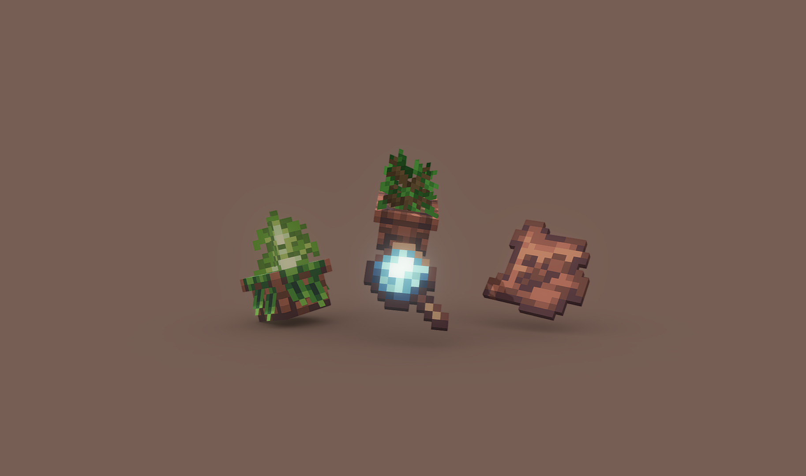
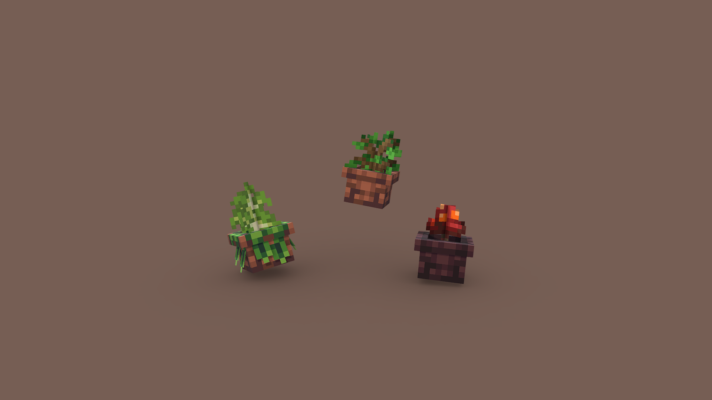
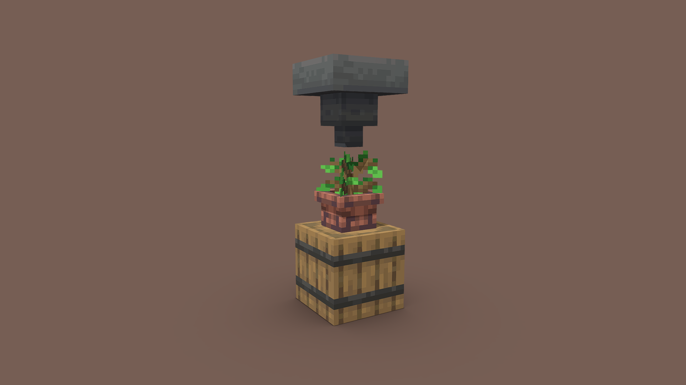

# Botanical Pots 🪴

> ‼️ Important
>
> **Botanical Pots** is a data-pack that relies on a mandatory resource-pack. The latter may be found on the bottom of the page of the version you wish to download. When installing the project as a mod, the resource-pack will be bundled in the JAR file.

Have you ever felt bored while waiting for a plant to grow? Or maybe you're not satisfied with how hard it is to automate the process of farming flowers, fungi, and most importantly, trees? Botanical Pots is a quick solution to both of these problems!

> ⚙️ Getting Started
>
> To obtain on a Botanical Pot, use a **Bone Meal** on a regular one.

Botanical Pots let you to grow plants in a much more reliable way. Planting one inside is enough to get the process going. Once grown,
the plant will drop the respective resources. Through _automation_ though, perfection can be achieved.

> 👀 Psst...
> 
> Most plants have a small chance of dropping a treat. This ranges from **Apples** to **Honeycombs**, just remain patient...

# Plant Research 🔎

Botanical Pots brings a lot of features that differ across various plant types. The above mentioned treats are one of those. The **Magnifying Glass** is a built-in research tool that lets you discover the specifics of each plant. You'll receive one when once you install the data-pack.

Among other specifics, each plant is categorized into one of five classes, sometimes called **Modifiers**. The class of a plant tells you its growth rate, the amount of resources it drops, whether it may produce a treat, and whether it's pretentious enough to require a richer soil. How exciting!

| Class    | Growth Rate | Resources | Pretentious | Treats |
| :------: | :---------: | :-------: | :---------: | :----: |
| Ingens   | 0.5x        | 1-4x      | ❌          | ✅     |
| Defixus  | 0.75x       | 1-2x      | ❌          | ✅     |
| Vulgaris | 1.0x        | 1x        | ❌          | ✅     |
| Arrogans | 1.5x        | 1-2x      | ✅          | ✅     |
| Mollis   | 2.0x        | 1-2x      | ✅          | ❌     |

# Music Preference 🎶

Have you any heard the rumors that plants enjoy **music**? In the world of Botanical Pots, those rumors turned out to be true! Playing a jukebox near a pot is beneficial for the plant's growth rate.

# Upgrading 🪽

Botnaical Pots may be **upraded** through various upgrades. Each upgrade slightly alters some part of the growth cycle. You may, however, only apply one upgrade at once. Choose wisely!

> 👀 Psst...
>
> I've heard the **Advancements** tab might contain some information on how to obtain each and every upgrade. If I were you, I'd take a look!

# Automation ⚙️

The growth process may further be automated. Placing a container below a Botanical Pot will cause its drops to be inserted inside of it. Similarly, if empty, an item will be taken from a nearby **Hopper**.

> ⚙️ The recent advances in technology...
> 
> Aside from the described automation techniques, a certain **upgrade** may automate the process even further.

